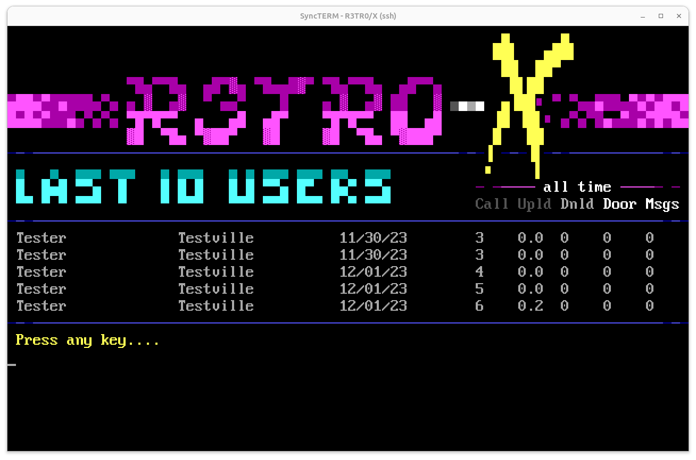

# last10-talisman
Last 10 Callers Mod for Talisman BBS

# About
This is a luascript mod for Talisman BBS. Only tested on Talisman v.048 under Ubuntu, with Syncterm. It writes callers to a JSON data file and then displays them, along with the user's lifetime caller stats. Optionally hides the sysop from display.

# Installation
See comments in lua files.
